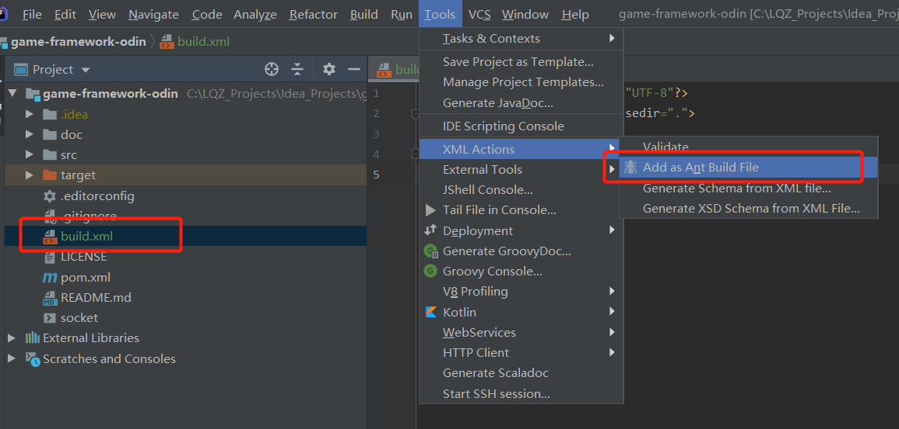
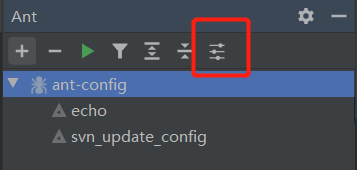
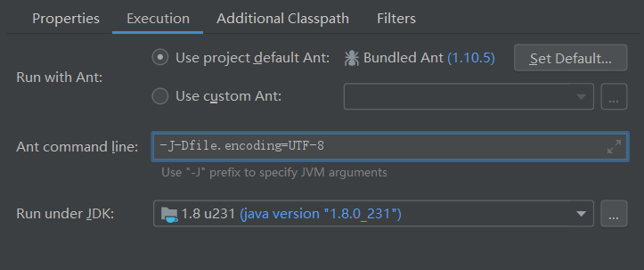

#### ant窗口问题



指定一个xml文件如上图操作，就能打开ant窗口，执行xml配置里的target任务啦

xml最简单的配置：

```xml
<?xml version="1.0" encoding="UTF-8"?>
<project name="ant-config" basedir=".">
	
</project>
```


#### ant乱码问题

* 执行`exec`乱码，如

  ```xml
  <target name="svn_update_config" description="svn更新配置文件">
  	<exec executable="cmd">
  		<arg value="/c"/>
  		<arg value="svn update"/>
  		<arg value="{config.path}"/>
  	</exec>
  </target>
  ```

  解决方案：设置ant properties > execution > ant command line **添加**`-J-Dfile.encoding=UTF-8`

  

  


* 执行java乱码问题

  解决方案：添加

  ```xml
  <sysproperty key="file.encoding" value="UTF-8"/>
  ```

  

#### ant版本与jdk版本问题

Exception in thread "main" com.intellij.rt.ant.execution.AntMain2$1: 
The version of the executed Ant is not compatible with the JRE version 1.7.0_80. 
To use Ant with this Java version, **download an older version of Ant**

其实也可以下载更新的jdk版本，在上图的`Run under JDK`那里指定一下就行